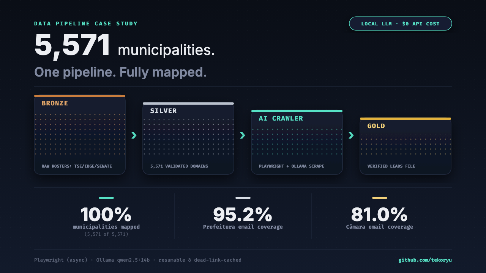
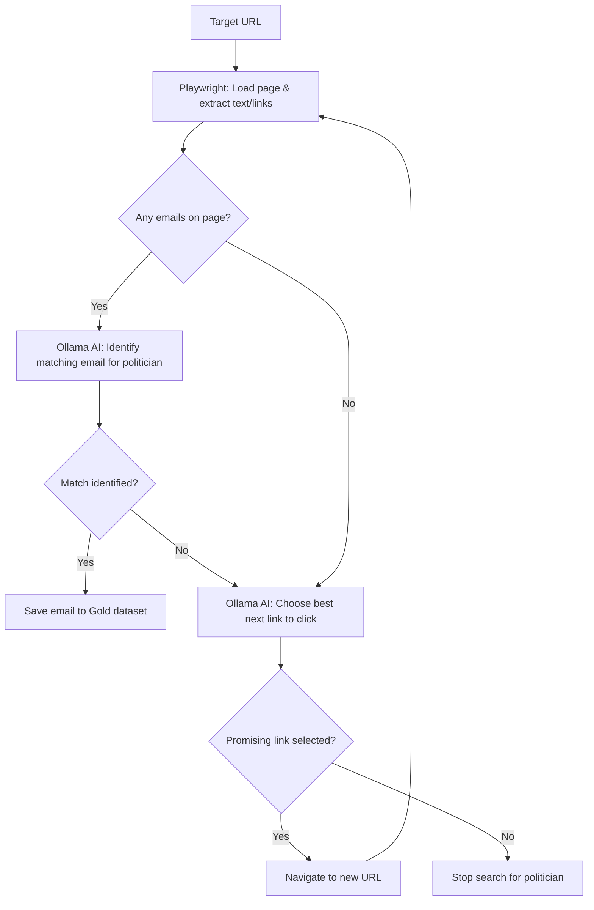

# Contato Vereadores Nacional

[](https://opensource.org/licenses/MIT)
[](https://www.python.org/downloads/)
[](https://playwright.dev/python/)
[](https://ollama.com/)

**The largest open dataset of contact information for Brazilian municipal legislators (*vereadores*), built with an autonomous AI data pipeline.**

This project demonstrates the power of combining traditional data engineering with local Large Language Models (LLMs). It maps the digital footprint of all 5,571 Brazilian municipalities and deploys an autonomous web crawler to navigate unstructured municipal websites, identify contact pages, and extract the official public emails of elected officials.



---

## 🚀 Key Achievements

- **Comprehensive Coverage:** Mapped official URLs for 100% of Brazil's 5,571 municipalities, achieving 95.2% coverage for *Prefeituras* and 81.0% for *Câmaras Municipais*.
- **Autonomous Navigation:** Built an async Playwright crawler that uses a local LLM (`qwen2.5:14b` via Ollama) to semantically navigate websites, successfully distinguishing between generic contact pages and specific politician profiles.
- **Cost-Effective AI:** Processed tens of thousands of web pages using local inference, completely eliminating API costs and rate limits associated with proprietary models like OpenAI or Anthropic.
- **Resilient Architecture:** Implemented a robust `asyncio` producer-worker queue with built-in backpressure, automatic dead-URL caching, and resumable execution states to handle the unreliability of municipal hosting.

## 🛠️ Technical Stack

- **Language:** Python 3.12+
- **Concurrency:** `asyncio`, `playwright` (headless Chromium)
- **AI / NLP:** Local LLM inference via `ollama`
- **Data Processing:** `pandas`, `pyarrow`
- **Configuration:** `tomllib` (centralized in `settings.toml`)
- **Version Control:** Git LFS (for managing the Bronze/Silver/Gold data layers)

## 📊 The Dataset & Methodology

The data pipeline operates in a Medallion Architecture:
1. **Bronze:** Raw inputs from TSE (Electoral Court), IBGE, and Senate datasets.
2. **Silver:** Normalized URLs, cached dead links, and intermediate AI extraction results.
3. **Gold:** The final, clean dataset mapping each elected *vereador* to their verified public email address.

For a detailed breakdown of how the URL discovery heuristics and the AI extraction logic work, read the [Data Pipeline Methodology](docs/HISTORY.md).

### Crawling & Decision Loop

The diagram below details the autonomous decision loop executed by the crawler for each politician:



---

## 💻 Try It Yourself

Want to see the autonomous agent in action? The pipeline is fully open-source and reproducible.

### Prerequisites
- Python 3.12+
- [Ollama](https://ollama.com/) installed and running locally
- Git LFS installed

### Installation

```bash
# 1. Clone the repository and pull the datasets
git clone https://github.com/tekoryu/contato-vereadores-nacional.git
cd contato-vereadores-nacional
git lfs pull

# 2. Set up the virtual environment
python3 -m venv .venv
source .venv/bin/activate

# 3. Install dependencies and browser binaries
pip install -e .
playwright install chromium

# 4. Pull the recommended local model
ollama pull qwen2.5:14b
```

### Running the Pipeline

The asynchronous pipeline is the recommended entry point. It will read the target roster, consult the URL map, and dispatch concurrent Playwright workers to hunt for emails.

```bash
python src/pipeline_async.py --concurrency 3
```

*Note: You can override the default model or concurrency by editing `settings.toml` or passing CLI arguments.*

### Running the Interactive Dashboard

You can explore and filter the final extracted politician leads dataset using the built-in Streamlit dashboard.

```bash
# Start the local dashboard server
streamlit run dashboard.py
```
This will spin up a local server on `http://localhost:8501` containing interactive KPI metrics, domain analytics charts, and a search-and-export leads table.

---

## 🤝 Hire Me

I built this project to showcase my ability to solve messy, real-world data problems by bridging the gap between robust software engineering and applied Artificial Intelligence. 

If your team needs an engineer who can build resilient data pipelines, integrate LLMs into production workflows, and drive projects from ambiguous requirements to measurable results, **let's talk.**

- **GitHub:** [github.com/tekoryu](https://github.com/tekoryu)
- **LinkedIn:** [https://www.linkedin.com/in/anderson-monteiro](https://www.linkedin.com/in/anderson-monteiro-3622923a3/?locale=en-US)
- **Email:** [alvesmonteiroanderson@gmail.com](mailto:alvesmonteiroanderson@gmail.com)

---

*Disclaimer: This project relies exclusively on publicly available data published by government entities in compliance with Brazilian transparency laws. The extracted contact information is intended strictly for civic engagement and public interest research.*
